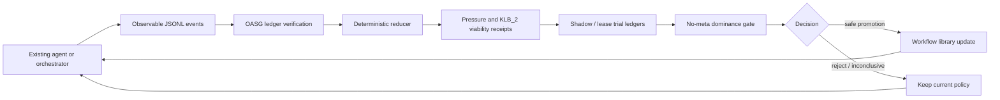

# OASG Quick Mental Model

OASG is easiest to understand as:

> Git + unit tests + CI gate + rollback receipts for an AI agent workflow.

It does not try to make the model smarter. It watches how the whole workflow behaves, records that
behavior in a tamper-checkable ledger, and allows workflow-policy changes only when the evidence
shows operational improvement without protected regression.

## The Everyday Engineering Analogy

| ordinary engineering system | OASG equivalent | what it means |
| --- | --- | --- |
| Git commit history | append-only JSONL event ledger | the agent records observable workflow facts |
| unit tests and linters | validators, replay checks, rollback checks | claims must be checked by observable receipts |
| CI status | no-meta dominance gate | a workflow change is accepted only if protected floors do not regress |
| staging rollout | shadow and lease trial ledgers | test a change before making it active |
| release tag | workflow library active policy | the promoted workflow policy used by later runs |
| revert commit | rollback receipt | a promoted policy can be backed out with evidence |

## Core Terms Without Theory Jargon

- **Ledger**: the workflow log. It is JSONL, append-only, hash-chained, and locally verifiable.
- **Debt**: operational work the agent has not paid back: failed validation, missing evidence,
  unresolved obligations, replay gaps, rollback gaps, stale policy, or queue pressure.
- **Trial**: a bounded test of a workflow-policy change. In production paths, evidence must come
  from runner-produced trial ledgers, not from candidate metadata.
- **Gate**: the CI-like decision. OASG compares baseline and candidate receipts and returns
  `safe_non_regression`, `safe_promotion`, `active_promoted`, `rejected`, or `inconclusive`.
- **Promotion**: making a workflow-policy change available for later runs. It is not model
  fine-tuning and not semantic certification.
- **Rollback**: returning to a previous workflow policy with a receipt trail.

## Where It Plugs In



OASG can sit beside a framework such as LangGraph or CrewAI. The orchestrator owns task execution,
state, and retries. OASG owns the evidence-backed decision about whether a workflow-policy change is
safe to promote.

## What OASG Is Not

- Not a model trainer or fine-tuner.
- Not an LLM judge.
- Not a benchmark score.
- Not a sandbox.
- Not an orchestration framework replacement.
- Not a proof of semantic truth.
- Not a universal claim that every agent improves.

## Five-Minute Path

1. Run the quickstart:

   ```bash
   uv sync
   uv run oasg demo quickstart
   uv run oasg conformance run examples/conformance
   ```

2. Run the minimal integration example:

   ```bash
   uv run python examples/minimal_agent_integration/minimal_agent.py --out-dir examples/minimal_agent_integration/out
   ```

3. Inspect the two gate outcomes:

   - `out/gate_missing_witness.json` should reject an unsupported improvement.
   - `out/gate_trial_backed.json` should accept a witness-backed safe promotion.

The important lesson is not the toy task. The important lesson is the insertion point: your agent
emits observable ledgers; OASG decides whether workflow-policy changes have enough evidence to be
promoted.
